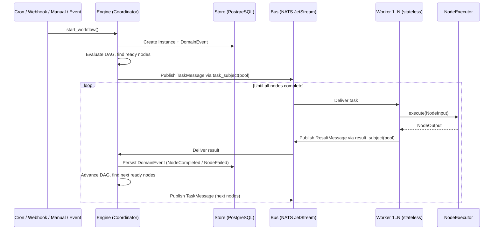

# Orbflow Architecture

Orbflow is a distributed workflow automation engine written in Rust (edition 2024, AGPL-3.0-or-later). It runs as two processes -- `orbflow-server` (coordinator + HTTP/gRPC API) and `orbflow-worker` (task executor) -- backed by PostgreSQL and NATS JetStream.

---

## Architecture Decisions

| # | Decision | Rationale |
|---|----------|-----------|
| ADR-001 | [Cargo workspace with adapter crates](adr/001-flat-packages.md) | `orbflow-core` defines ports; adapter crates implement them. Dependencies point inward. No circular deps by Cargo design. |
| ADR-002 | [Event sourcing + snapshotting](adr/002-event-sourcing.md) | Full audit trail, crash recovery via replay, configurable snapshot interval |
| ADR-003 | [CEL for expressions](adr/003-cel-expressions.md) | Non-Turing complete, linear time, no side effects, sandbox-safe by design |
| ADR-004 | NATS JetStream for messaging | Work-queue retention, at-least-once delivery, embeddable for dev |
| ADR-005 | Saga pattern (orchestration) | Centralized compensation; coordinator walks executed nodes in reverse on failure |
| ADR-006 | Axum for HTTP API | Tower middleware ecosystem, async-native, strong typing with extractors |
| ADR-007 | JSON-RPC subprocess plugins | Process-isolated, language-agnostic, simple protocol |
| ADR-008 | AGPL-3.0 license | Protects SaaS business model |
| ADR-009 | Immutable domain objects | Engine creates new Instance copies rather than mutating in place |
| ADR-010 | DashMap + per-instance locking | `DashMap<InstanceId, Arc<Mutex<()>>>` for concurrent result handling with optimistic retry |

---

## Project Structure

```
crates/
  orbflow-core/          Domain types + port traits (the only cross-crate import)
  orbflow-engine/        DAG coordinator, CEL evaluation, saga compensation, crash recovery
  orbflow-postgres/      PostgreSQL persistence with event sourcing + snapshots
  orbflow-memstore/      In-memory store for testing
  orbflow-natsbus/       NATS JetStream message transport
  orbflow-httpapi/       Axum REST API (CORS, rate limiting, 1MB body limit)
  orbflow-grpcapi/       gRPC API surface (JSON codec over TCP)
  orbflow-worker/        Task executor: subscribes to bus, routes to NodeExecutor impls
  orbflow-builtins/      Built-in nodes (HTTP, email, transform, filter, delay, sort,
                         encode, template, log, MCP tool, AI nodes)
  orbflow-trigger/       Cron scheduler + webhook + event trigger system
  orbflow-plugin/        External plugin loader via JSON-RPC subprocess protocol
  orbflow-cel/           CEL expression evaluator with program cache
  orbflow-config/        YAML config loading with env var expansion + tracing setup
  orbflow-mcp/           MCP client: schema, transport, tool invocation
  orbflow-registry/      Node/plugin registry: manifest parsing, index, remote client
  orbflow-testutil/      MockBus, MockStore, MockNodeExecutor for testing
  orbflow-test/          Integration test harness: runner, assertions, test types
  orbflow-server/        Server binary: wires Postgres + NATS + engine + HTTP + gRPC
  orbflow-worker-bin/    Worker binary: wires NATS + builtins + plugins

apps/web/                Next.js 16 frontend (Turbopack, visual builder + execution monitor)
packages/orbflow-core/   Headless SDK (Zustand stores, types, hooks, schemas)
configs/                 YAML configuration files
proto/                   gRPC/Protobuf definitions
```

---

## Ports & Adapters

`orbflow-core` defines all domain types and port traits. Every other crate implements one adapter. Dependencies point inward -- only `orbflow-core` is imported across crate boundaries.

### Port Traits (`orbflow-core::ports`)

- **`Engine`** -- orchestrate workflows: create/start/cancel, register node executors
- **`Store`** = `WorkflowStore` + `InstanceStore` + `EventStore` -- persistence
- **`Bus`** -- publish/subscribe message transport between coordinator and workers
- **`NodeExecutor`** -- execute a single node:
  ```rust
  async fn execute(&self, input: &NodeInput) -> Result<NodeOutput, OrbflowError>
  ```
- **`CredentialStore`** -- encrypted credential management (AES-256-GCM)
- **`RbacStore`** -- role-based access control
- **`MetricsStore`**, **`AnalyticsStore`** -- usage metering and workflow analytics
- **`BudgetStore`** -- execution budget tracking
- **`AlertStore`** -- alerting rules and notifications
- **`ChangeRequestStore`** -- approval workflows for changes
- **`PluginManager`** -- manages external plugin processes (start/stop/reload)
- **`PluginIndex`** -- lists/queries available plugins in the registry
- **`PluginInstaller`** -- downloads and installs plugins

### Adapter Crate Map

| Crate | Implements | Purpose |
|-------|-----------|---------|
| `orbflow-engine` | `Engine` | DAG coordinator, CEL evaluation, saga compensation, crash recovery |
| `orbflow-postgres` | `Store` | PostgreSQL persistence with event sourcing + snapshots |
| `orbflow-memstore` | `Store` | In-memory store for testing |
| `orbflow-natsbus` | `Bus` | NATS JetStream message transport |
| `orbflow-httpapi` | -- | Axum REST API with CORS, rate limiting, 1MB body limit |
| `orbflow-grpcapi` | -- | gRPC API surface (JSON codec over TCP) |
| `orbflow-worker` | -- | Task executor: subscribes to bus, routes to `NodeExecutor` impls |
| `orbflow-builtins` | `NodeExecutor` | Built-in nodes (see below) |
| `orbflow-trigger` | -- | Cron scheduler + webhook + event trigger system |
| `orbflow-plugin` | `PluginManager` | External plugin loader via JSON-RPC subprocess protocol |
| `orbflow-cel` | -- | CEL expression evaluator with program cache |
| `orbflow-config` | -- | YAML config loading with env var expansion + tracing setup |
| `orbflow-mcp` | -- | MCP client: schema, transport, tool invocation |
| `orbflow-registry` | `PluginIndex`, `PluginInstaller` | Node/plugin registry: manifest parsing, index, remote client |
| `orbflow-testutil` | -- | MockBus, MockStore, MockNodeExecutor for testing |
| `orbflow-test` | -- | Integration test harness: runner, assertions, test types |
| `orbflow-server` | -- | Server binary: wires Postgres + NATS + engine + HTTP + gRPC |
| `orbflow-worker-bin` | -- | Worker binary: wires NATS + builtins + plugins |

---

## Execution Data Flow



### Completion and Failure

- **Success**: All terminal nodes complete
- **Failure**: Node fails after retries --> saga compensation (reverse walk of executed nodes) --> instance marked failed
- **Crash recovery**: Worker restart: unacked messages redeliver. Engine restart: load running instances, replay events from last snapshot, resume

---

## Core Domain Model

All domain types live in `orbflow-core`:

- **`workflow`** -- `Workflow` (DAG blueprint), `Node` (atomic unit with type, config, input mapping, retry policy), `Edge` (connection with CEL condition)
- **`execution`** -- `Instance` (running workflow with node states, execution context, saga state), `NodeState` (per-node status/input/output/attempt)
- **`event`** -- `DomainEvent` variants: InstanceStarted, NodeQueued, NodeStarted, NodeCompleted, NodeFailed, InstanceCompleted, InstanceFailed, InstanceCancelled, CompensationStarted, CompensationCompleted, NodeApprovalRequested, NodeApproved, NodeRejected, AnomalyDetected, ChangeRequestStateChanged, PolicyChanged
- **`validate`** -- DAG validation: DFS cycle detection, connectivity check, edge endpoint validation
- **`wire`** -- Bus message types (`TaskMessage`, `ResultMessage`)
- **`credential`** -- Encrypted credential types with AES-256-GCM
- **`trigger`** -- Trigger types and configuration (cron, webhook, event)
- **`rbac`** -- Roles, permissions, policies, bindings

---

## Builtin Nodes

All builtin executors in `orbflow-builtins` follow the same pattern:

```rust
#[async_trait]
impl NodeExecutor for MyNode {
    async fn execute(&self, input: &NodeInput) -> Result<NodeOutput, OrbflowError> {
        let cfg = resolve_config(input);
        // ... validate, execute, return
        Ok(NodeOutput { data: Some(result), error: None })
    }
}

impl NodeSchemaProvider for MyNode {
    fn node_schema(&self) -> NodeSchema { /* field definitions */ }
}
```

**Available builtins** (21 nodes): HTTP, email, transform, filter, delay, sort, encode, template, log, capability-postgres, MCP tool, trigger nodes (manual, cron, webhook, event), and AI nodes (chat, classify, extract, sentiment, summarize, translate).

AI nodes share common infrastructure via `ai_common.rs`. The `ssrf.rs` module provides SSRF protection for the HTTP node. Builtins are wired via `register.rs`.

---

## Error Handling

`OrbflowError` enum in `orbflow-core::error` (28 variants). Key variants: `NotFound`, `AlreadyExists`, `Conflict`, `CycleDetected`, `InvalidNodeConfig(String)`, `Forbidden(String)`, `BudgetExceeded(String)`. DAG validation errors: `DuplicateNode`, `DuplicateEdge`, `InvalidEdge`, `NoEntryNodes`, `Disconnected`. Infrastructure wrappers: `Database(String)`, `Bus(String)`, `Internal(String)`.

The `is_validation_error()` method identifies client-side mistakes, mapped to HTTP 400 / gRPC InvalidArgument.

### HTTP API Response Envelope

All responses use a consistent envelope:

```json
{ "data": T, "error"?: "string", "meta"?: { "total": 42, "offset": 0, "limit": 20 } }
```

Error responses include `"data": null`.

---

## Frontend

**Stack**: Next.js 16 (Turbopack), React 19, TypeScript, TailwindCSS 4, Zustand, @xyflow/react

```
apps/web/                Next.js 16 app (visual builder + execution monitor)
packages/orbflow-core/   Headless SDK (Zustand stores, types, hooks -- zero CSS)
```

`packages/orbflow-core` exports Zustand stores consumed by `apps/web`:
`canvasStore`, `workflowStore`, `executionOverlayStore`, `credentialStore`, `alertStore`, `budgetStore`, `changeRequestStore`, `nodeOutputCacheStore`, `historyStore`, `panelStore`, `pickerStore`, `toastStore`, `NodeSchemaRegistry`, `createApiClient()`.

`apps/web` has two layers:
- `src/core/` -- Embeddable workflow builder components (canvas, config modal, toolbar)
- `src/components/` -- App-specific features (workflow-builder, execution-viewer, credential-manager)

---

## Key Patterns

- **CEL expressions**: All dynamic values use CEL. Values prefixed with `=` in the frontend are CEL expressions evaluated by the engine via `orbflow-cel`.
- **Event sourcing**: Instance state changes are persisted as `DomainEvent` variants with periodic snapshots for crash recovery.
- **Builder pattern**: `EngineOptionsBuilder` for engine/worker construction.
- **Immutable domain objects**: Engine creates new Instance copies rather than mutating in place.
- **Per-instance locking**: `DashMap<InstanceId, Arc<Mutex<()>>>` for concurrent result handling with optimistic locking retry (max 3 attempts).
- **Wire compatibility**: JSON field names use snake_case matching the frontend's `api.ts` types.

---

## Verification

```bash
just test           # Run all Rust tests
just test-web       # Run frontend tests
just test-all       # Run all tests (Rust + frontend)
just lint           # cargo clippy --workspace -- -D warnings
just fmt-check      # Check formatting
just ci             # Full CI pipeline: format + lint + test + build
```
