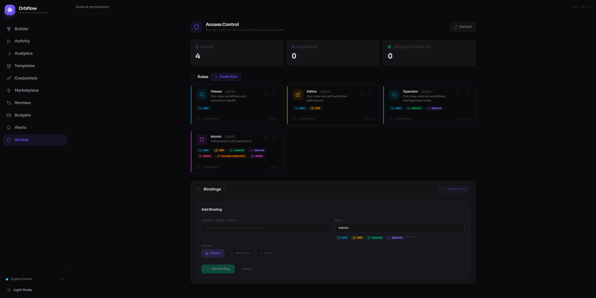

# Access Control

The Access page is where you manage who can do what in your Orbflow workspace. It brings together roles, permissions, and bindings into a single view so you can grant the right level of access to every user and team -- and adjust it whenever your needs change.

You can open the Access page from the left sidebar by clicking **Access**. The page header displays a shield icon and the subtitle "Manage roles, permissions, and who can access what."

---

## Summary Cards

At the top of the page, three summary cards give you an at-a-glance count of your access configuration:

| Card | What it shows |
|------|---------------|
| **Roles** | The total number of roles defined in your workspace, including both system roles and any custom roles you have created. |
| **Bindings** | The total number of role-to-subject assignments. Each binding ties one user or team to one role at a specific scope. |
| **Unique Subjects** | The number of distinct users or teams that have at least one binding. If the same user is bound to multiple roles, they are only counted once here. |

These cards update instantly as you add or remove roles and bindings -- even before you save.

---

## Refresh Button

A **Refresh** button sits in the top-right corner of the page. Clicking it reloads the current access policy from the server, discarding any unsaved local changes. Use it when you want to pull in changes made by another admin, or to reset the page to the last saved state.

---

## Roles

The **Roles** section lists every role in your workspace as expandable cards, arranged in a grid. Each card shows:

- **Icon** -- a visual indicator of the role's power level (shield for admin-tier, pencil for editor-tier, magnifying glass for viewer-tier).
- **Name** -- the human-readable role name (e.g., "Viewer", "Editor", "Admin").
- **ID** -- a short code used internally by Orbflow, shown in monospace text (e.g., `viewer`, `editor`).
- **Badge** -- either **System** (for built-in roles that ship with Orbflow) or **Custom** (for roles you created).
- **Description** -- a short summary of what the role is for.
- **User count** -- how many bindings currently reference this role (e.g., "2 users").
- **Permission count** -- how many permissions the role grants (e.g., "3 perms").
- **Expand chevron** -- click the card to expand it and see the full permission matrix.

### System Roles

Orbflow ships with four built-in system roles. These roles cannot be deleted or have their permissions changed, which guarantees a stable baseline for your access model.

| Role | Permissions | Description |
|------|-------------|-------------|
| **Viewer** | view | Can view workflows and execution results. |
| **Editor** | view, edit | Can view and edit workflow definitions. |
| **Operator** | view, execute, approve | Can view, execute workflows, and approve nodes. |
| **Admin** | view, edit, execute, approve, delete, manage credentials, admin | Full access to all operations. |

Each system role card is marked with a **System** badge. When expanded, granted permissions are shown as colored badges, while permissions the role does not have appear dimmed and struck through. This makes it easy to compare what different roles can and cannot do.

### Expanding a Role Card

Click anywhere on a role card to expand it. The expanded view shows every available permission as a badge:

| Permission | What it allows |
|------------|----------------|
| **view** | View workflows, execution results, and read-only data. |
| **edit** | Create and modify workflow definitions. |
| **execute** | Start workflow executions. |
| **approve** | Approve pending nodes that require manual sign-off. |
| **delete** | Delete workflows, executions, and other resources. |
| **manage credentials** | Create, update, and delete stored credentials. |
| **admin** | Full administrative access, including managing roles and bindings. |

Permissions the role has are highlighted in color. Permissions it does not have are shown as faded and crossed out so you can see the full picture at a glance.

### Custom Roles

If the four system roles do not match your needs, you can create your own.

**Creating a custom role:**

1. Click the **+ Create Role** button in the top-right corner of the Roles section.
2. A form appears with the following fields:
   - **Name** -- a human-readable name (3 to 64 characters). Required.
   - **ID** -- a machine-readable identifier, auto-generated from the name as you type. You can override it manually. Only lowercase letters, numbers, and hyphens are allowed. The ID cannot be changed after creation.
   - **Description** -- an optional note describing what this role is for.
   - **Permissions** -- click the permission badges to toggle them on or off. At least one permission must be selected.
3. Click **Create Role** to add it. The new role appears as a card in the grid, marked with a **Custom** badge.

**Editing a custom role:**

1. Expand the custom role card by clicking it.
2. Click the **Edit** button that appears at the bottom of the expanded card.
3. Update the name, description, or permissions as needed.
4. Click **Save** to apply your changes, or **Cancel** to discard them.

**Deleting a custom role:**

1. Expand the custom role card by clicking it.
2. Click the **Delete** button.
3. A confirmation banner appears, warning you how many bindings will be removed along with the role.
4. Click **Delete** to confirm, or **Cancel** to keep the role.

Deleting a role automatically removes all bindings that reference it.

---

## Bindings

The **Bindings** section is where you connect users and teams to roles. A binding says: "This subject has this role, at this scope."

The section is displayed as a bordered panel with a header showing the total binding count. On desktop, bindings are shown in a table. On mobile, they appear as compact cards.

### Binding Table Columns

| Column | Description |
|--------|-------------|
| **Subject** | The user or team name (e.g., an email address like `user@example.com` or a team name like `platform-team`). Each subject is shown with an avatar circle displaying its first initial. |
| **Role** | The role assigned to this subject, shown as a badge with a shield icon. |
| **Scope** | Where this binding applies -- **Global**, **Workflow**, or **Node** (see Scope below). |
| **Remove** | A remove button (X icon) that appears on hover. Clicking it shows a confirmation prompt before the binding is removed. |

### Adding a Binding

1. Click the **+ Add Binding** button in the top-right corner of the Bindings section.
2. A form appears with the following fields:
   - **Subject (User / Team)** -- type a username or email address. A dropdown auto-suggests subjects that already have bindings, so you can quickly re-use existing names. You can also type a new subject that is not in the list.
   - **Role** -- select a role from the dropdown. All roles (system and custom) are listed. When you select a role, a preview of its permissions appears below the dropdown so you can confirm you are choosing the right one.
   - **Scope** -- choose where this binding applies:
     - **Global** -- the subject has this role across the entire workspace.
     - **Workflow** -- the subject has this role only for a specific workflow. A Workflow ID field appears when you select this option.
     - **Node** -- the subject has this role only for a specific node within a specific workflow. Both a Workflow ID and a Node ID field appear.
3. Click **Add Binding** to create it, or **Cancel** to close the form.

### Removing a Binding

Hover over any binding row (or tap on mobile) to reveal the remove button. Clicking it shows a confirmation banner:

> Remove binding for **subject-name**?

Click **Remove** to confirm, or **Cancel** to keep the binding.

### Filtering Bindings

When you have more than three bindings, a **search field** appears in the Bindings header. Type a subject name or role ID to filter the list in real time. Click the **X** inside the search field or use the **Clear filter** link to reset.

If no bindings match your filter, the page displays: "No bindings match 'your-query'" with a link to clear the filter.

### Empty State

When no bindings have been configured, the Bindings section shows a friendly empty state:

> **No bindings configured**
> Add a binding to grant users access to your workspace.

An **Add First Binding** button is displayed so you can get started right away.

---

## Scope

Every binding has a scope that controls where the role's permissions apply:

| Scope | Meaning |
|-------|---------|
| **Global** | The role applies to everything in the workspace. This is the most common choice. |
| **Workflow** | The role applies only to a single workflow, identified by its Workflow ID. The subject has no access to other workflows unless granted by another binding. |
| **Node** | The role applies only to a specific node within a specific workflow, identified by both a Workflow ID and a Node ID. This is the most granular scope. |

Scopes are shown as colored tags: green for Global, amber for Workflow, and blue for Node. Workflow- and Node-scoped tags also display the relevant IDs so you can see exactly what they apply to.

When Orbflow checks whether a subject has a permission, it uses the **most specific scope first**. A Node-scoped binding takes precedence over a Workflow-scoped one, which takes precedence over a Global binding.

---

## Saving Changes

Changes you make on the Access page -- adding roles, editing permissions, creating or removing bindings -- are held locally until you explicitly save them.

When you have unsaved changes, several things happen:

- An **Unsaved changes** indicator appears in the header with a pulsing amber dot.
- A **sticky action bar** appears at the bottom of the page, showing a summary of what changed (e.g., "1 role(s) added, 2 binding(s) added").
- Two buttons are available:
  - **Discard** -- reverts all changes back to the last saved state.
  - **Save Changes** -- sends your updated policy to the server. While saving, the button shows a spinner and the text "Saving...".

After a successful save, a green **Saved** confirmation badge briefly appears in the header.

### Validation

Orbflow enforces a few rules before allowing you to save:

- **At least one admin binding is required.** If you remove all bindings that use a role with the `admin` permission, a warning banner appears: "At least one binding must use a role with admin permission." The Save button is disabled until this is resolved.
- **Custom roles must have permissions.** If a custom role has no permissions selected, you will see: "Role 'role-name' must have at least one permission."
- **System roles are protected.** You cannot delete, rename, or modify the permissions of the four built-in system roles (Viewer, Editor, Operator, Admin). This prevents accidental lockouts.

---

## Tips for Managing Access

- **Start with system roles.** The four built-in roles cover the most common access patterns. Try assigning users to these before creating custom roles.
- **Use Global scope for simplicity.** Unless you need to restrict a user to a specific workflow or node, Global bindings are easier to manage and understand.
- **Create custom roles for specialized teams.** For example, a "CI Bot" role with only `view` and `execute` permissions is useful for automated pipeline runners that should never edit workflows.
- **Keep at least one admin binding.** Orbflow prevents you from saving a policy with no admin access, but it is good practice to ensure more than one person has admin access in case someone leaves.
- **Review bindings regularly.** As your team grows, check the Bindings section to make sure former team members have been removed and new members have the right roles.
- **Use the search filter.** When your binding list grows, the search field helps you quickly find a specific user or role without scrolling.
