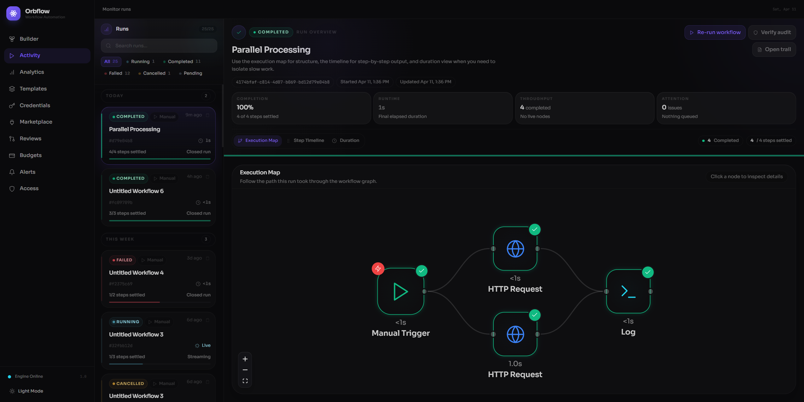

# Activity

The Activity page is your window into every workflow run. It shows a live-updating list of all executions across your workflows, lets you filter and search by status, and opens a detailed inspection workspace when you select a run. Whether a workflow just finished, failed halfway through, or is still streaming results, this is where you come to understand what happened and why.

---

## Runs list

The left sidebar displays every workflow execution as a scrollable list of run cards. A counter in the top-right corner shows how many runs match your current filters out of the total (e.g. **3/12**).

### Status filters

A row of filter pills sits below the search bar. Each pill shows a colored dot and a count so you can see the distribution at a glance:

| Filter | What it shows |
|---|---|
| **All** | Every run regardless of status |
| **Running** | Executions that are actively in progress |
| **Completed** | Runs that finished successfully |
| **Failed** | Runs that encountered an error and stopped |
| **Cancelled** | Runs that were manually cancelled |
| **Pending** | Runs that are queued but have not started executing yet |

Click a filter to narrow the list. Only one filter can be active at a time. Click **All** to reset.

### Search

The search field at the top of the sidebar accepts free-text queries. It matches against both the **workflow name** and the **instance ID**, so you can paste a run ID directly to jump to it. Clear the search with the small **X** button that appears inside the field.

### Run cards

Each card in the list summarizes a single execution:

- **Status badge** -- a colored pill (e.g. "completed", "running", "failed") with a dot that matches the status color.
- **Trigger type** -- a small tag showing how the workflow was started: Manual, Webhook, Schedule, or Event.
- **Workflow name** -- the name of the workflow that was executed.
- **Short ID** -- the last 8 characters of the instance ID, displayed in monospace for easy reference. Click the clipboard icon next to it to copy the full ID.
- **Relative time** -- how long ago the run started (e.g. "5m ago", "2h ago").
- **Duration** -- for finished runs, the total elapsed time (e.g. "12s", "1m 04s"). For running workflows, a spinning loader icon and the label **Live** appear instead.
- **Progress bar** -- a thin bar at the bottom showing how many steps have settled out of the total (e.g. "3/5 steps settled"). The bar color reflects the run status: green for completed, red for failed, cyan for running.
- **Run state label** -- text below the progress bar reading **Streaming** (while running), **Closed run** (when finished), or **Queued** (when pending).

The currently selected card is highlighted with an indigo border. A colored accent line on the left edge of each card reflects its status.

### Time grouping

Runs are organized into chronological sections so you can quickly orient yourself:

- **Today** -- runs started today
- **Yesterday** -- runs from the previous day
- **This Week** -- runs from the last seven days
- **Earlier** -- anything older

Each group header shows the number of runs it contains.

---

## Activity workspace

The right side of the page is the detail workspace. Before you select a run, it shows a welcoming prompt:

> **Pick a run to inspect what happened**
>
> The selected run opens with a readable summary, execution map, timeline, audit tools, and node details in one place.

Once you click a run card (or navigate with the keyboard), the workspace fills with everything you need to understand that execution.

### Run header

The top of the workspace shows a summary banner for the selected run:

- **Status icon and badge** -- the run status with a matching colored icon (the icon spins for running workflows).
- **Workflow name** -- the full name of the workflow.
- **Instance ID** -- the complete run identifier in a monospace pill.
- **Start and update times** -- when the run was created and last updated.
- **Action buttons** -- contextual actions depending on the run state:
  - **Re-run workflow** -- available for completed, failed, or cancelled runs. Starts a fresh execution of the same workflow.
  - **Cancel run** -- available only while a run is in progress. Opens a confirmation dialog before stopping the execution.
  - **Verify audit** -- checks that the run's audit trail has not been tampered with.
  - **Open trail / Hide trail** -- toggles the audit trail panel.

### Metric cards

Four metric tiles appear below the header, giving you a quick numerical summary:

| Metric | What it shows |
|---|---|
| **Completion** | Percentage of steps that have settled (completed, failed, cancelled, or skipped) |
| **Runtime** | Elapsed wall-clock time since the run started. Updates live for running workflows. |
| **Throughput** | Number of steps that completed successfully, with a note if any are still running |
| **Attention** | Combined count of failed and cancelled steps, with a note about pending steps |

### Progress bar

A thin colored bar spans the full width below the metric cards. It fills proportionally to the completion percentage and uses the status accent color (green for completed, red for failed, cyan for running, etc.).

---

## Visualization modes

Below the metrics, a segmented control lets you switch between three ways of viewing the execution:

### Execution Map

The default view. Renders the workflow as an interactive graph using the same visual language as the Builder, but in read-only mode. Each node is color-coded by its execution status:

- **Green** -- completed successfully
- **Red** -- failed
- **Cyan (animated)** -- currently running
- **Gray** -- pending, not yet reached
- **Amber** -- cancelled

Edges between nodes animate for running connections. Click any node in the graph to open its detail panel. A stats bar above the graph shows how many steps have completed out of the total, with inline counters for failed and running nodes.

### Step Timeline

A vertical timeline that lists every step in topological (execution) order. Each step shows:

- A colored dot on the timeline track (pulsing for running steps).
- The node name and ID.
- A status badge.
- An expand arrow for steps that have output, input, or error data.

Click a step to expand it in-line and see:

- **Error** -- the error message if the step failed, displayed in a bordered panel.
- **Output** -- the structured output data produced by the step.
- **Input** -- the input data the step received.
- **Attempt count** -- shown when a step was retried more than once.
- **View Details** -- a link to open the full node detail panel.

### Duration

A timeline visualization focused on performance. Shows how long each step took relative to the others, making it easy to identify bottlenecks and understand where time was spent.

---

## Node detail panel

When you click a node in any visualization mode, a detail panel opens on the right side of the workspace. The panel content depends on whether the node has a registered schema:

**For nodes with a schema** (most built-in nodes), a read-only version of the node configuration modal opens, showing the same three-panel layout as the Builder (Input, Parameters, Output) but populated with the actual runtime values.

**For nodes without a schema**, a drawer-style panel opens showing:

- Node ID and status badge
- Error message (if the step failed)
- Input and output data as formatted JSON with syntax highlighting
- Copy buttons for all data sections

If a node is in a **waiting for approval** state, an approval gate appears at the bottom of the panel with **Approve** and **Reject** buttons.

### Approval checkpoints

When a running workflow has nodes waiting for manual approval, a yellow banner appears below the run header. Each waiting node is listed with:

- The node name and a "waiting for approval" message
- **Approve** -- advances the workflow past the checkpoint
- **Reject** -- stops the workflow at the checkpoint
- **View node** -- opens the node detail panel for inspection before deciding

---

## Audit trail panel

Click **Open trail** in the run header to view the full audit trail for the selected execution. The audit trail is a cryptographically chained sequence of events that records every state change during the run.

Each event row in the trail shows:

- **Sequence number** -- the event's position in the chain.
- **Event type** -- the kind of state change (e.g. InstanceCreated, NodeStarted, NodeCompleted).
- **Signature badge** -- whether the event is cryptographically signed ("Signed" in green, or "Unsigned").
- **Integrity proof** -- click "Proof" to verify the cryptographic proof for an individual event. Shows "Valid" or "Invalid" after verification.
- **Timestamp** -- when the event occurred.
- **Hash chain** -- the previous hash and current event hash, displayed as clickable short hashes (click to copy the full hash).

At the top of the audit panel you can:

- **Verify Chain** -- validates the entire hash chain and signature integrity. Shows a green checkmark with the event count when valid, or a red indicator if the chain is broken.
- **Export** -- download the audit trail in compliance-ready formats: SOC2, HIPAA, or PCI.

---

## Keyboard shortcuts

You can navigate the Activity page without touching the mouse:

| Shortcut | Action |
|---|---|
| **J** or **Arrow Down** | Move focus to the next run in the list |
| **K** or **Arrow Up** | Move focus to the previous run in the list |
| **Enter** | Select the currently focused run and open it in the workspace |
| **Click** | Select a run directly |
| **Ctrl+Enter** | Run a workflow (from the Builder tab) |

Keyboard navigation is disabled while focus is inside a text input or textarea, so it will not interfere with searching.

---

## Live updates

The Activity page automatically refreshes to keep you up to date:

- **Instance list** -- polls every 5 seconds while the Activity tab is active and the browser tab is visible. Polling pauses automatically when you switch to another browser tab.
- **Selected running instance** -- polls every 3 seconds for updated node states so you can watch progress in real time.
- **Running indicators** -- run cards for active workflows show a spinning loader icon, the label **Live**, and the text **Streaming** below the progress bar. The progress bar animates as steps complete.
- **Failed instance retry** -- if a failed run is missing error details when first selected, the page automatically retries after 2 seconds to fetch the complete error information.

When a workflow finishes, the card updates in place with the final duration and the progress bar fills to reflect the outcome.
