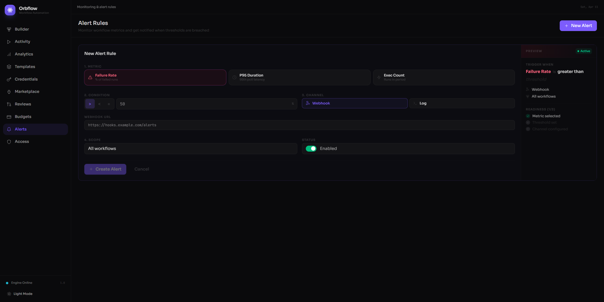

# Alerts

The Alerts page lets you set up monitoring rules so you know the moment something goes wrong with your workflows. Define thresholds for key metrics -- failure rates, latency, execution counts -- and Orbflow will notify you automatically when those thresholds are breached.

## Alert Rules

At the top of the page you will see the **Alert Rules** header with the description "Monitor workflow metrics and get notified when thresholds are breached." To its right is the **+ New Alert** button, which opens the alert creation form inline.

When you have not created any alerts yet, the page shows an empty state with a bell icon, the message **"No alert rules configured"**, and a prominent **"Create your first alert"** button. Clicking either that button or **+ New Alert** in the header opens the same creation form.

## What You Can Monitor

Each alert rule watches one of three workflow metrics:

| Metric | What it measures | Unit | Example |
|--------|-----------------|------|---------|
| **Failure Rate** | The percentage of workflow executions that fail | % | Alert when failure rate > 10% |
| **P95 Duration** | How long the slowest 5% of runs take -- 95% of runs finish faster than this value | ms | Alert when P95 latency > 3000ms |
| **Execution Count** | The number of workflow executions in a period | count | Alert when execution count > 500 |

You can scope each alert to a **specific workflow** or apply it to **all workflows** in your workspace.

### Severity Levels

Orbflow automatically assigns a severity to each alert based on its threshold:

- **Critical** -- Failure rate thresholds at or above 50%, or P95 duration thresholds at or above 5000ms. These show a pulsing red indicator.
- **Warning** -- All other thresholds. These show a steady amber indicator.

## Notification Channels

When an alert fires, Orbflow sends a notification through the channel you configure:

- **Webhook** -- Sends an HTTP POST to the URL you provide. Use this to integrate with Slack, PagerDuty, Discord, or any service that accepts incoming webhooks.
- **Log** -- Writes the alert to the server log. Useful during development or when you already have log aggregation in place.

## Creating an Alert Rule

Click **+ New Alert** to open the inline creation form. The form walks you through four steps, with a live preview panel on the right that updates as you fill in each field.

### Step 1: Metric

Choose which metric to monitor. Click one of the three metric cards:

- **Failure Rate** -- percentage of failed runs
- **P95 Duration** -- 95th percentile latency
- **Execution Count** -- number of runs in the period

### Step 2: Condition

Set the comparison operator and threshold value:

- Pick an operator: **>** (greater than), **<** (less than), or **=** (equals)
- Enter a numeric threshold (the unit label adjusts automatically based on the metric you chose)

### Step 3: Channel

Select how you want to be notified:

- **Webhook** -- enter the full URL where Orbflow should send alert payloads (e.g., `https://hooks.example.com/alerts`)
- **Log** -- no additional configuration needed

### Step 4: Scope

Choose which workflows this alert applies to:

- **All workflows** -- the alert monitors every workflow in your workspace
- **Specific workflow** -- pick one workflow from the dropdown

You can also toggle the **Enabled / Disabled** switch to control whether the alert starts active or paused.

### Readiness Checklist

The preview panel on the right side of the form shows a readiness checklist with three items:

1. Metric selected
2. Threshold set
3. Channel configured

All three must be complete before you can save. The **Create Alert** button stays disabled until the form is valid.

### Saving

Click **Create Alert** to save your new rule. Click **Cancel** to discard your changes and close the form.

## Managing Alert Rules

Once you have created alerts, the page shows two additional sections above your alert cards.

### Summary Cards

Four cards at the top give you an at-a-glance overview:

- **Total** -- the total number of alert rules
- **Active** -- how many are currently enabled (green indicator)
- **Paused** -- how many are disabled (gray indicator)
- **Metrics** -- color-coded count of alerts by metric type

### Filtering

Below the summary cards, filter controls let you narrow the list:

- **Metric filter** -- show all alerts, or only those watching Failure Rate, P95 Duration, or Execution Count
- **Status filter** -- show all, enabled only, or disabled only

A counter on the right shows how many alerts match (e.g., "3 of 5 alerts").

### Alert Cards

Each alert rule appears as a card showing:

- The **metric icon** and name (color-coded: rose for failure rate, amber for duration, sky-blue for execution count)
- The **condition** in shorthand (e.g., "> 10%")
- A **severity badge** (Critical or Warning)
- The **notification channel** (Webhook or Log)
- The **workflow scope** (a specific workflow name or "All workflows")
- A preview of the **webhook URL** if applicable

### Editing an Alert

Click the **pencil icon** on any alert card to reopen the inline form pre-filled with that alert's current settings. Make your changes and click **Update Alert** to save.

### Enabling and Disabling

Each card has a **toggle switch** on the right side. Flip it to enable or disable the alert without deleting it. Disabled alerts appear dimmed so you can tell at a glance which rules are active.

### Deleting an Alert

Click the **trash icon** on any alert card. A confirmation dialog appears warning that the alert will be permanently deleted and you will no longer receive notifications for that threshold. Click **Delete** to confirm or **Cancel** to keep the alert.
