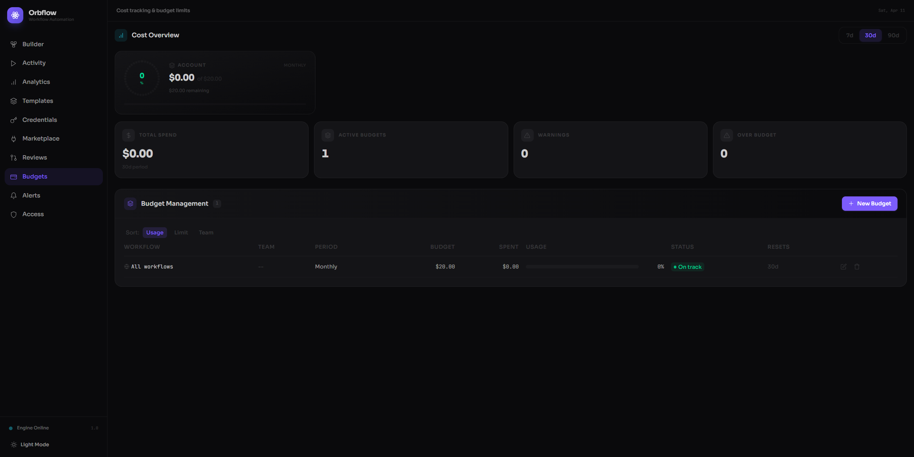

# Budgets

The Budgets page helps you keep execution costs under control. You can set spending limits for individual workflows or entire teams, monitor how much of each budget has been used, and receive warnings before costs exceed your thresholds.

## Getting started

When you first open the Budgets page, you will see an empty state with the message **"No budgets configured"** and a brief explanation of what budgets do. Click the **+ Create First Budget** button to set up your first spending limit.

Once you have at least one budget, the page switches to a full dashboard with cost analytics, gauge cards, and a budget management table.

## What budgets track

Each budget tracks the dollar amount spent on workflow executions over a rolling time period. Orbflow measures:

- **Current spend** -- how much has been consumed so far in the active period.
- **Budget limit** -- the maximum amount you have allocated.
- **Usage percentage** -- current spend divided by the limit, shown as a progress bar and a gauge ring.
- **Time until reset** -- how many days remain before the period resets and the counter starts over.

Budgets also project whether you are on pace to exceed your limit before the period ends, so you can act early rather than react after the fact.

## Creating a budget

Click **+ New Budget** (or **+ Create First Budget** if no budgets exist yet). An inline form appears with four fields:

1. **Workflow** -- choose a specific workflow from the dropdown, or leave it set to **All workflows (account-wide)** to cap spending across every workflow.
2. **Team** (optional) -- type a team name such as `engineering` or `marketing` to scope the budget to a particular group.
3. **Period** -- select **Daily**, **Weekly**, or **Monthly**. The budget resets automatically at the end of each period.
4. **Limit (USD)** -- enter the maximum dollar amount allowed for the chosen period. The minimum is $0.01.

Click **Create Budget** to save. The new budget appears immediately in the table and starts tracking costs.

## Cost overview dashboard

Once budgets are active, the top of the page shows a **Cost Overview** section with real-time analytics.

### Gauge cards

The top three budgets ranked by usage percentage are displayed as large gauge cards. Each card shows:

- A circular gauge ring that fills as spending increases (green when healthy, amber when approaching the limit, red when over budget).
- The current dollar amount spent and the total limit.
- How much budget remains.
- The budget period (daily, weekly, or monthly).

### Summary metrics

Below the gauge cards, four metric tiles give you a quick snapshot:

| Metric | What it shows |
|--------|---------------|
| **Total Spend** | Combined cost across all workflows for the selected time range |
| **Active Budgets** | Number of budgets currently configured |
| **Warnings** | Count of budgets between 80% and 100% of their limit |
| **Over Budget** | Count of budgets that have exceeded their limit |

### Time range selector

Use the **7d**, **30d**, or **90d** toggle in the top-right corner of the Cost Overview section to change the analytics window.

### Cost by Workflow breakdown

When cost data is available, a ranked table shows each workflow's share of total spend. For every workflow you can see:

- A proportional progress bar comparing its cost to the total.
- The percentage of overall spend.
- The absolute dollar amount.
- The number of executions (runs).
- The average cost per execution (visible on hover).

## Budget alerts and status indicators

Orbflow uses color-coded status badges so you can spot problems at a glance:

| Badge | Condition | Meaning |
|-------|-----------|---------|
| **On track** (green) | Usage below 80% | Spending is well within the limit |
| **Warning** (amber) | Usage between 80% and 100% | Costs are approaching the threshold |
| **Projected over** (amber) | Usage 80-100% and projected to exceed | At the current burn rate, the budget will be exceeded before the period resets |
| **Over budget** (red, pulsing) | Usage above 100% | The limit has been exceeded |

These badges appear in the budget table next to each entry, giving you an immediate visual signal of which budgets need attention. Pair budgets with [Alerts](./alerts.md) to receive notifications when thresholds are crossed.

## Preventing runaway execution costs

Budgets are your safety net against unexpected cost spikes. A few practical strategies:

- **Start with account-wide budgets.** Set a monthly limit across all workflows first, then add per-workflow budgets for your most expensive automations.
- **Use short periods for volatile workflows.** A daily budget catches runaway loops within hours instead of waiting until the end of the month.
- **Watch the "Projected over" indicator.** It uses your current burn rate to forecast whether you will exceed the limit, giving you time to pause or adjust the workflow before costs pile up.
- **Combine with alerts.** Create an alert rule that fires when a budget crosses 80% so the right people are notified immediately.

## Managing budgets

### Editing a budget

In the budget table, click the **pencil icon** on the row you want to change. The inline form reopens with the budget's current values pre-filled. Adjust the workflow, team, period, or limit and click **Update Budget** to save.

### Deleting a budget

Click the **trash icon** on any row. A confirmation dialog appears warning that cost tracking will stop for that budget. Click **Delete** to confirm or **Cancel** to keep it.

### Sorting the table

Above the budget table you will find sort buttons for **Usage**, **Limit**, and **Team**. Click any of them to reorder the rows:

- **Usage** -- highest usage percentage first (default).
- **Limit** -- highest dollar limit first.
- **Team** -- alphabetical by team name.

### Table columns

Each row in the budget table displays:

| Column | Description |
|--------|-------------|
| Workflow | The workflow name, or "All workflows" for account-wide budgets |
| Team | The team the budget is scoped to, or `--` if unscoped |
| Period | Daily, Weekly, or Monthly |
| Budget | The spending limit in USD |
| Spent | Current spend in the active period |
| Usage | A progress bar with the percentage consumed |
| Status | The color-coded status badge |
| Resets | Days remaining until the period resets |
| Actions | Edit and delete buttons |
