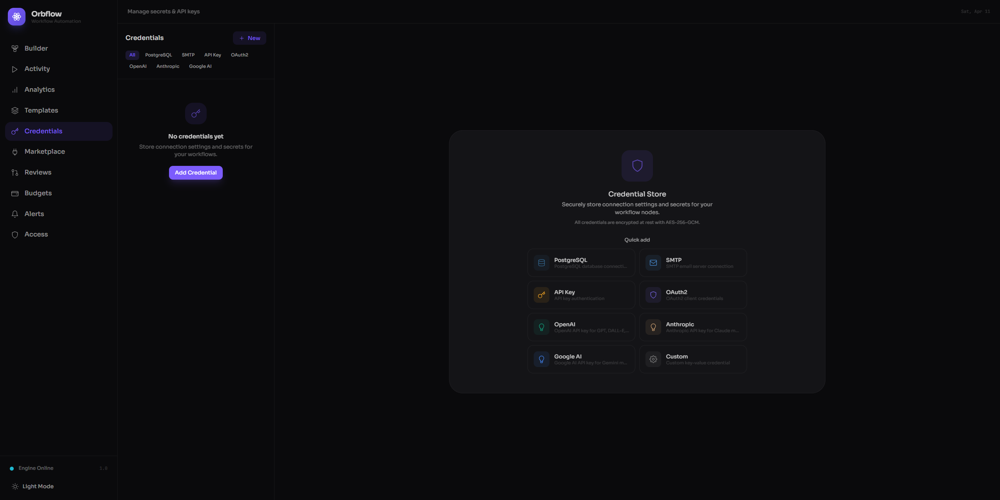

# Credentials

The Credentials page is where you manage the secrets, API keys, and connection settings that your workflow nodes need to talk to external services. Every credential you store here is protected with **industry-standard encryption** (AES-256-GCM), so your sensitive data stays safe even if the underlying storage is compromised.

---

## Page Layout

The Credentials page uses a **two-pane layout**:

- **Left pane -- Credential list.** A sidebar that shows all your saved credentials. You can filter, search, and select credentials here.
- **Right pane -- Detail / form panel.** When no credential is selected, this pane shows the **Credential Store** welcome screen with quick-add cards. When you select or create a credential, it becomes the editing form.

On smaller screens the two panes stack -- the list takes full width, and tapping a credential navigates you into the form view with a back arrow to return.

---

## Creating a Credential

Click the **"+ New"** button in the top-right corner of the credential list to start creating a credential. The right pane switches to a creation form with these steps:

1. **Choose a credential type.** A grid of cards shows every supported type. Click one to select it.
2. **Give it a name.** This is how you will identify the credential later when configuring workflow nodes. Names should be descriptive (e.g., "Production Postgres" or "Marketing SMTP").
3. **Add a description** (optional). A short note to help you or your teammates remember what this credential is for.
4. **Fill in the connection settings.** Each credential type has its own set of fields -- host, port, username, API key, and so on. Required fields are marked with an asterisk.
5. **Select an access tier.** This controls how Orbflow shares the credential with plugins (see [Access Tiers](#access-tiers) below).
6. Click **"Create Credential"** to save.

---

## Filtering and Searching

### Type filter pills

A row of filter pills sits below the header in the credential list. Click any pill to show only credentials of that type:

- **All** -- show every credential (default)
- **PostgreSQL**
- **SMTP**
- **API Key**
- **OAuth2**
- **OpenAI**
- **Anthropic**
- **Google AI**

Click an active filter again to deselect it and return to the full list.

### Search

When you have more than three credentials, a search bar appears at the top of the list. Type any part of a credential name to narrow the results instantly.

---

## Quick-Add Cards

When no credential is selected, the right pane displays the **Credential Store** welcome screen. Below the description you will find a **Quick add** grid -- one card per credential type. Clicking a card immediately opens the creation form with that type pre-selected, saving you a step.

---

## Credential List

Each entry in the credential list shows:

- **Icon** -- a color-coded icon matching the credential type (e.g., a database icon for PostgreSQL, an envelope for SMTP).
- **Name** -- the label you gave the credential.
- **Type** -- the credential type displayed below the name.
- **Access tier badge** -- a small colored badge indicating the credential's access tier:
  - **Proxied** (green) -- Orbflow proxies requests on your behalf.
  - **Scoped** (amber) -- plugins receive a temporary, limited token.
  - **Raw** (red) -- plugins receive the full key directly.
- **Description** -- if you added one, it appears next to the type.
- **Delete button** -- a trash icon appears on hover. Clicking it opens a confirmation dialog warning that any workflows using this credential will stop working.

Click any credential in the list to open its details in the right pane, where you can edit the name, description, connection settings, or access tier and then click **"Update Credential"** to save changes.

---

## Access Tiers

Every credential has an **access tier** that determines how Orbflow shares it with workflow nodes and plugins. You choose the tier when creating or editing a credential.

| Tier | Badge | Description |
|------|-------|-------------|
| **Proxy** | Proxied (green) | Orbflow proxies API calls on your behalf -- the plugin never sees your key. This is the recommended default. When Proxy is selected, you can optionally specify **Allowed Domains** to restrict which hosts Orbflow will forward requests to (e.g., `api.openai.com, api.anthropic.com`). |
| **Scoped Token** | Scoped (amber) | The plugin receives a temporary, limited-scope token instead of your real key. |
| **Raw** | Raw (red) | The plugin receives your full API key. A warning banner appears reminding you to only use this tier with plugins you fully trust. |

---

## Encryption

All credentials are **encrypted at rest** using industry-standard encryption (AES-256-GCM). This means:

- Your API keys, passwords, and tokens are never stored in plain text.
- Even database administrators cannot read credential values without the encryption key.
- The encryption is transparent -- you enter your credentials in the form, and Orbflow handles the rest.

---

## Supported Credential Types

| Type | Typical fields | Use case |
|------|---------------|----------|
| **PostgreSQL** | Host, port, database, username, password, SSL mode | Database queries and data nodes |
| **SMTP** | Host, port, username, password, from address | Sending emails from workflow nodes |
| **API Key** | API key, header name, prefix | Generic REST API integrations |
| **OAuth2** | Client ID, client secret, token URL, scopes | Services requiring OAuth2 flows |
| **OpenAI** | API key, organization ID, base URL | AI nodes (chat, classify, extract, summarize, etc.) |
| **Anthropic** | API key, base URL | AI nodes powered by Anthropic models |
| **Google AI** | API key, base URL | AI nodes powered by Google models |
| **Custom** | Free-form key-value pairs you define | Any service not covered by the built-in types |

The **Custom** type lets you add arbitrary key-value pairs using the **"+ Add Field"** button. Each field has a key (plain text) and a value (masked input). This is useful for niche integrations where none of the built-in schemas fit.

---

## Using Credentials in Workflow Nodes

Workflow nodes that need external access -- such as HTTP request, email, database, or AI nodes -- include a **credential selector** dropdown in their configuration panel. This dropdown lists all saved credentials, filtered to the types the node supports.

To wire a credential into a node:

1. Open the node's configuration modal in the Builder.
2. Find the **Credential** field (usually under the Parameters tab).
3. Select a credential from the dropdown. Only credential types compatible with that node are shown.

The node will use the selected credential at execution time, respecting the access tier you configured. You can change which credential a node uses at any time without editing the credential itself.
